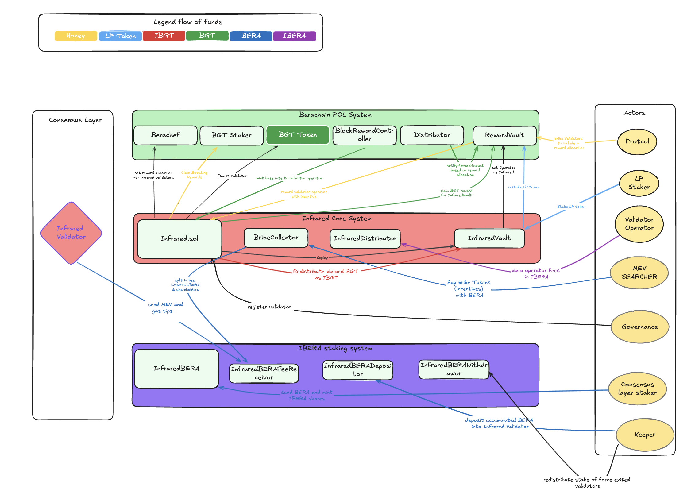

# Infrared Protocol

The Infrared Protocol revolutionizes the way users engage with the Berachain ecosystem, particularly in how they stake consensus assets and receive the [Proof-of-Liquidity inflation](https://docs.berachain.com/learn/what-is-proof-of-liquidity#what-is-proof-of-liquidity). It enables users to stake their assets effortlessly and receive IBGT, a liquid staked representation of BGT, significantly enhancing BGT's utility. Additionally, Infrared democratizes access to Validator staking through the IBERA contract suite, a liquid staking token tightly integrated with Proof-of-Liquidity (POL) and the Infrared ecosystem.

## Learn More
- [Architecture](https://docs.infrared.finance/developers/architecture)
- [Deployed Addresses](https://docs.infrared.finance/testnet/deployments)
- [Audits](https://docs.infrared.finance/developers/audits)

## Contract Architecture



https://link.excalidraw.com/l/1Tuu8vTTCh1/1f3jMvwGuuS

### Core Contracts

- [full overview here](https://github.com/infrared-dao/infrared-contracts/blob/develop/src/core/README.md)

- `IBERA.sol`: Main liquid staking token contract. Handles minting/burning of iBERA, facilitates POL rewards and manages validators.
- `InfraredVault.sol`: Manages staking pools and reward distribution. Integrates with Berachain's POL system.
- `InfraredDistributor.sol`: Handles distribution of validator rewards and commission management.
- `BribeCollector.sol`: Collects and auctions bribes from Berachain reward vaults.

### Staking Contracts

- [full overview here](https://github.com/infrared-dao/infrared-contracts/blob/develop/src/staking/README.md)

- `IBERADepositor.sol`: Handles deposits to CL through Berachain beacon deposit contract.
- `IBERAWithdrawor.sol`: Manages withdrawals from CL through Berachain precompiles.
- `IBERAClaimor.sol`: Processes user claims for withdrawn funds.
- `IBERAFeeReceivor.sol`: Receives and processes validator rewards from EL.

### Voting Contracts

- [full overview here](https://github.com/infrared-dao/infrared-contracts/blob/develop/src/voting/README.md)

- `VotingEscrow.sol`: Implementation of vote-escrowed NFTs (veNFTs) for protocol governance.
- `Voter.sol`: Manages voting logic for POL cutting board allocation.
- `MultiRewards.sol`: Base contract for reward distribution across multiple tokens.

## Getting Started

### Prerequisites

```bash
# Install Foundry
curl -L https://foundry.paradigm.xyz | bash
foundryup
```

### Quick Start

```bash
# Clone the repository
git clone https://github.com/infrared-dao/infrared-contracts.git
cd infrared-protocol

# Install dependencies
forge install

# Build contracts
forge build

# Run tests
forge test

```

## Integration Guide

Developers who want to integrate with `InfraredVault` and `IBGTVault` can do so by following these steps:

### Installation

Add the `infrared-contracts` to your Foundry project:
```bash
forge install infrared-dao/infrared-contracts
```

Update your `foundry.toml` with the following remapping:
```toml
@infrared/=lib/infrared-contracts/contracts
```

### Example Usage
```solidity
import {IInfrared} from '@infrared/interfaces/IInfrared.sol';
import {IInfraredVault} from '@infrared/interfaces/IInfraredVault.sol';
import "@openzeppelin/contracts/token/ERC20/IERC20.sol";

// Query InfraredVault
IInfraredVault infraredVault = IInfrared(infrared).vaultRegistry(asset);

// Stake into InfraredVault
IERC20(asset).approve(address(infraredVault), amount);
infraredVault.stake(amount);

// Check earned rewards
IInfraredVault.RewardData[] memory rTs = infraredVault.getUserRewardsEarned(user);

// Harvest rewards
infraredVault.getReward();

// Withdraw assets and harvest remaining rewards
infraredVault.exit();
```
# Infrared
